# Developer Documentation - Managing Forks and Contributions

This document explains how to manage the Next.js Blog Template repository, handle contributions from forks, and maintain synchronization between the main repository and community forks.

## Repository Workflow Policy

### Branch Protection and Pull Request Workflow

**Important:** All changes to the main branch must go through pull requests. Direct pushes to main are not allowed.

#### Workflow for All Changes:

1. **Create Feature Branch**
   ```bash
   git checkout main
   git pull origin main
   git checkout -b feature/descriptive-name
   ```

2. **Make Changes and Commit**
   ```bash
   git add .
   git commit -m "feat: descriptive commit message"
   ```

3. **Push Branch and Create PR**
   ```bash
   git push origin feature/descriptive-name
   # Then create PR through GitHub interface
   ```

4. **Review and Merge**
   - All PRs require review
   - Use squash merge for clean history
   - Delete branch after merge

#### Branch Naming Conventions:
- `feature/add-new-functionality` - New features
- `fix/resolve-deployment-issue` - Bug fixes
- `docs/update-user-manual` - Documentation updates
- `refactor/improve-code-structure` - Code improvements
- `chore/update-dependencies` - Maintenance tasks

#### Benefits of This Workflow:
- **Code review** - All changes are reviewed before merging
- **Clean history** - Squash merges keep main branch clean
- **Rollback capability** - Easy to revert problematic changes
- **Collaboration** - Multiple people can work on features safely
- **CI/CD integration** - Automated testing on PRs before merge

## Repository Structure Overview


## Current Situation Analysis

### Main Repository: `rkristelijn/next-blog`
- **Purpose**: Template repository for community use
- **Content**: Generic blog posts demonstrating features
- **Audience**: Developers wanting to start their own blog
- **Maintenance**: You (rkristelijn) maintain this

### Gertjan's Fork: `gjvdptev/next-blog`
- **Purpose**: Personal blog with custom content
- **Content**: Gertjan's personal blog posts and customizations
- **Audience**: Gertjan's blog readers
- **Maintenance**: Gertjan maintains his content, you help with technical issues

## Fork Relationship Diagram


## Best Practices for Managing Contributions

### 1. Handling Pull Requests from Forks

#### ✅ **Accept These Changes:**
- Documentation improvements
- Bug fixes
- New features that benefit all users
- Troubleshooting guides
- Code quality improvements

#### ❌ **Reject These Changes:**
- Personal blog content
- Fork-specific customizations
- Breaking changes without discussion
- Large refactors without prior agreement

### 2. Selective Integration Process


## Git Commands for Fork Management

### Setting Up Remote Tracking

```bash
# Add Gertjan's fork as a remote
git remote add gjvdptev https://github.com/gjvdptev/next-blog.git

# Verify remotes
git remote -v
# origin    https://github.com/rkristelijn/next-blog.git (fetch)
# origin    https://github.com/rkristelijn/next-blog.git (push)
# gjvdptev  https://github.com/gjvdptev/next-blog.git (fetch)
# gjvdptev  https://github.com/gjvdptev/next-blog.git (push)
```

### Fetching and Reviewing Fork Changes

```bash
# Fetch all changes from Gertjan's fork
git fetch gjvdptev

# List branches in the fork
git branch -r | grep gjvdptev

# Create local branch to review his changes
git checkout -b review-gjvdptev-changes gjvdptev/main

# Compare with your main branch
git diff main..review-gjvdptev-changes --name-only

# See specific file differences
git diff main..review-gjvdptev-changes -- path/to/file
```

### Selective Cherry-Picking

```bash
# View commit history from fork
git log --oneline gjvdptev/main ^main

# Cherry-pick specific commits (useful changes only)
git checkout main
git cherry-pick <commit-hash>

# Cherry-pick specific files from a commit
git checkout <commit-hash> -- path/to/useful/file
git add path/to/useful/file
git commit -m "feat: add useful feature from gjvdptev"
```

### Handling Pull Requests Locally

```bash
# Fetch PR branch (replace 2 with PR number)
git fetch origin pull/2/head:pr-review

# Switch to PR branch for review
git checkout pr-review

# Create clean branch for selective integration
git checkout main
git checkout -b integrate-pr-2

# Selectively add files you want to keep
git checkout pr-review -- docs/USER-MANUAL.md
git add docs/USER-MANUAL.md
git commit -m "feat: add USER-MANUAL.md from PR #2"

# Push the clean integration
git push origin integrate-pr-2

# Merge to main
git checkout main
git merge integrate-pr-2
git push origin main
```

## Keeping Forks in Sync

### Sync Strategy Diagram


### Automated Sync Script

Create `scripts/sync-with-fork.sh`:

```bash
#!/bin/bash

FORK_OWNER="gjvdptev"
FORK_REPO="next-blog"

echo "🔄 Syncing with $FORK_OWNER/$FORK_REPO"

# Fetch latest from fork
git fetch $FORK_OWNER

# Show differences
echo "📊 Changes in fork:"
git log --oneline main..$FORK_OWNER/main

# Show file differences
echo "📁 Modified files:"
git diff --name-only main..$FORK_OWNER/main

# Create review branch
git checkout -b review-$FORK_OWNER-$(date +%Y%m%d) $FORK_OWNER/main

echo "✅ Review branch created. Check changes and cherry-pick what you need."
```

### Helping Forks Stay Updated

```bash
# Create update branch for fork
git checkout -b update-for-gjvdptev

# Add helpful commits
git commit -m "fix: resolve deployment issues for web-only users"
git commit -m "docs: add troubleshooting for common fork problems"

# Push and create PR to fork
git push origin update-for-gjvdptev

# Then create PR from your repo to gjvdptev/next-blog
```

## Communication Best Practices

### PR Review Template

```markdown
## Review Summary

### ✅ Accepted Changes:
- [ ] Documentation improvements
- [ ] Bug fixes
- [ ] Generic features

### ❌ Excluded Changes:
- [ ] Personal blog content
- [ ] Fork-specific customizations

### 🔄 Next Steps:
- [ ] Integrated useful changes in commit: [hash]
- [ ] Updated documentation
- [ ] Provided feedback for excluded items

### 💡 Recommendations for Fork:
- Keep personal content in your fork
- Consider contributing generic improvements back
- Follow sync process for template updates
```

### Issue Templates for Fork Problems

Create `.github/ISSUE_TEMPLATE/fork-sync-help.md`:

```markdown
---
name: Fork Sync Help
about: Help with keeping your fork synchronized
title: '[FORK-SYNC] '
labels: 'help wanted, fork'
---

## Fork Information
- Fork URL: 
- Last sync date: 
- Issue description: 

## What you've tried:
- [ ] Followed sync documentation
- [ ] Checked troubleshooting guide
- [ ] Reviewed git commands

## Specific Problem:
<!-- Describe the sync issue you're experiencing -->
```

## Monitoring Fork Health

### Fork Status Dashboard

```mermaid
graph LR
    A[Main Repo Status] --> B[Active Forks: 5]
    B --> C[Healthy: 3]
    B --> D[Behind: 1]
    B --> E[Issues: 1]
    
    C --> F[gjvdptev: ✅ Synced]
    C --> G[user2: ✅ Active]
    C --> H[user3: ✅ Updated]
    
    D --> I[user4: ⚠️ 10 commits behind]
    E --> J[user5: ❌ Deployment broken]
    
    style A fill:#e8f5e8
    style C fill:#e8f5e8
    style D fill:#fff3cd
    style E fill:#f8d7da
```



### Regular Maintenance Tasks

```bash
# Weekly fork health check
scripts/check-fork-health.sh

# Monthly sync with active forks
scripts/sync-all-forks.sh

# Quarterly cleanup of old branches
git branch -r | grep -E "(pr-|review-|integrate-)" | xargs git push origin --delete
```

## Troubleshooting Common Fork Issues

### Issue: Fork Can't Deploy

**Symptoms:**
- GitHub Actions failing
- "loopt toch weer niet door" (doesn't run through)

**Solution Process:**
```bash
# 1. Check their workflow file
git fetch gjvdptev
git show gjvdptev/main:.github/workflows/deploy.yml

# 2. Compare with main template
git diff main:/.github/workflows/deploy.yml gjvdptev/main:.github/workflows/deploy.yml

# 3. Create fix branch
git checkout -b fix-gjvdptev-deployment
git checkout main -- .github/workflows/deploy.yml
git commit -m "fix: update deployment workflow for fork"

# 4. Create PR to their fork
git push origin fix-gjvdptev-deployment
```

### Issue: Merge Conflicts During Sync

```bash
# 1. Create conflict resolution branch
git checkout -b resolve-gjvdptev-conflicts gjvdptev/main

# 2. Merge main (will show conflicts)
git merge main

# 3. Resolve conflicts keeping their personal content
# Edit conflicted files manually

# 4. Complete merge
git add .
git commit -m "resolve: merge conflicts keeping personal content"

# 5. Push resolution
git push gjvdptev resolve-gjvdptev-conflicts
```

## Best Practices Summary

### For Main Repository (You):
1. **Keep template generic** - No personal content
2. **Accept useful contributions** - Documentation, bug fixes, features
3. **Provide clear feedback** - Explain what's accepted/rejected
4. **Maintain sync helpers** - Scripts and documentation
5. **Monitor fork health** - Regular check-ins with active contributors

### For Fork Maintainers (Like Gertjan):
1. **Keep personal content separate** - Don't PR personal blog posts
2. **Contribute generic improvements** - Documentation, bug fixes
3. **Stay synced regularly** - Don't let forks get too far behind
4. **Follow contribution guidelines** - Use proper commit messages
5. **Ask for help when needed** - Use issues for technical problems

### Communication Guidelines:
1. **Be respectful** - Contributors are volunteering their time
2. **Be clear** - Explain decisions and provide examples
3. **Be helpful** - Provide troubleshooting and guidance
4. **Be consistent** - Apply same standards to all contributors
5. **Be appreciative** - Acknowledge valuable contributions

---

*This documentation should be updated as the project evolves and new patterns emerge.*
