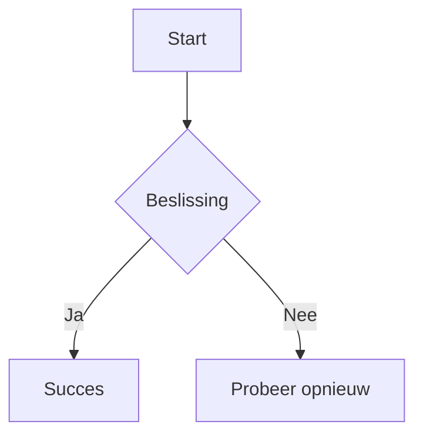
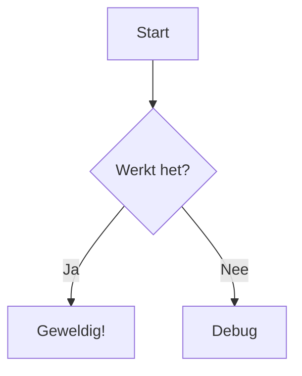
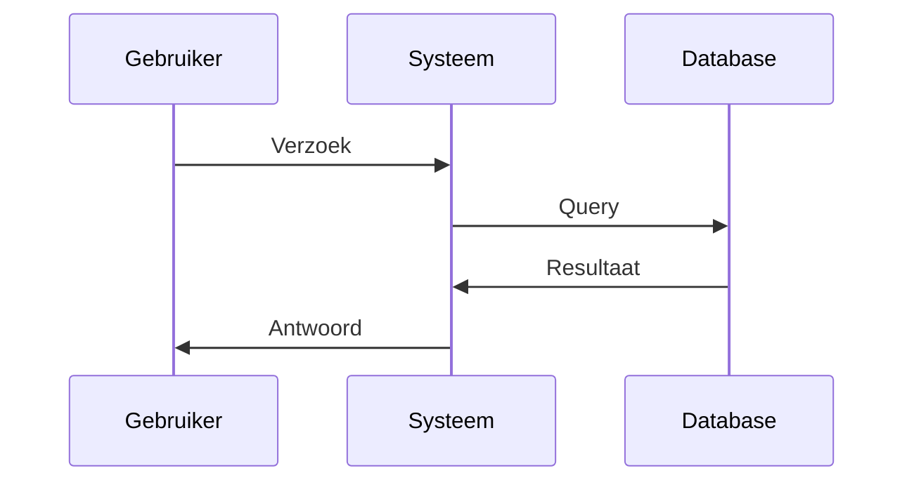
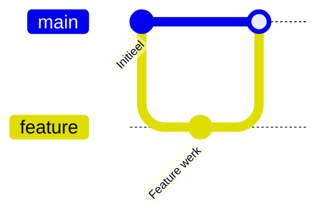
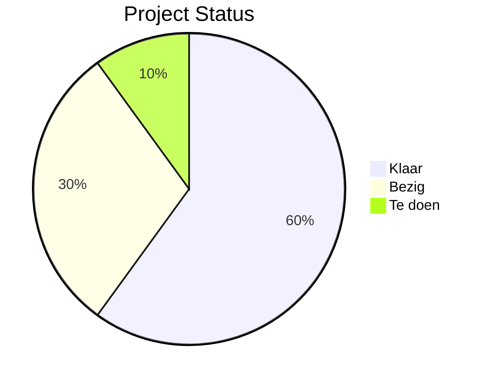
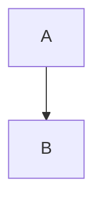

# 📖 Gebruikershandleiding - Next.js Blog

Een complete handleiding voor het gebruik van je Next.js blog, speciaal geschreven voor gebruik in de GitHub browser IDE.

## 🚀 Snel starten

### Blog post maken
1. Ga naar je repository op GitHub
2. Druk op `.` om github.dev te openen
3. Navigeer naar `src/content/posts/`
4. Maak een nieuw bestand: `XX-mijn-post-titel.mdx`
5. Gebruik de template hieronder
6. Commit je wijzigingen
7. Je post is automatisch live binnen 2 minuten!

## 📝 Blog Post Template

```markdown
---
title: "Jouw Blog Post Titel"
date: "2025-01-25"
author: "Jouw Naam"
excerpt: "Een korte beschrijving van je post (verplicht!)"
---

# Jouw Blog Post Titel

Hier begint je blog post content...

## Een subkopje

Meer tekst hier.

### Nog een subkopje

- Lijst item 1
- Lijst item 2
- Lijst item 3

**Belangrijke tekst** en *cursieve tekst*.
```

## 📊 Diagrammen maken met Mermaid

### Wat is Mermaid?
Mermaid stelt je in staat om diagrammen en flowcharts te maken met eenvoudige tekst syntax. Perfect voor technische documentatie, procesflows en visuele uitleg.

### Hoe voeg je diagrammen toe?

Gebruik gewoon een code block met `mermaid` als taal:

````markdown

````

### Ondersteunde Diagram Types

#### 1. Flowcharts (Stroomdiagrammen)


#### 2. Sequence Diagrams (Volgorde diagrammen)


#### 3. Git Graphs


#### 4. Taartdiagrammen


### Mermaid Bronnen

- **Officiële Documentatie**: https://mermaid.js.org/
- **Live Editor**: https://mermaid.live/
- **Syntax Gids**: https://mermaid.js.org/syntax/flowchart.html
- **Voorbeelden Galerij**: https://mermaid.js.org/syntax/examples.html

### Tips voor Betere Diagrammen

1. **Houd het simpel** - Maak diagrammen niet te vol
2. **Gebruik duidelijke labels** - Maak knooppunten helder en leesbaar
3. **Test in live editor** - Gebruik https://mermaid.live/ om syntax te testen
4. **Denk aan mobiel** - Diagrammen moeten leesbaar zijn op kleine schermen

## 🖼️ Plaatjes toevoegen

### Stap 1: Plaatje uploaden
1. Ga naar de `public/` folder in je repository
2. Klik "Add file" → "Upload files"
3. Sleep je plaatje(s) erin
4. Commit de wijzigingen

### Stap 2: Plaatje gebruiken in je post

#### Eenvoudige manier:
```markdown

```

#### Plaatje kleiner maken:
```markdown

```

#### Gecentreerd plaatje:
```markdown

```

#### Plaatje met caption:
```markdown
<div style="text-align: center; margin: 20px 0;">
  
  <p style="font-style: italic; margin-top: 10px;">Dit is een caption onder het plaatje</p>
</div>
```

### 💡 Plaatje tips:
- **Formaten**: JPG, PNG, GIF, SVG werken allemaal
- **Grootte**: Houd plaatjes onder 1MB voor snelle loading
- **Namen**: Gebruik hyphens: `mijn-plaatje.jpg` (geen spaties!)
- **Optimaliseren**: Gebruik TinyPNG.com om bestanden kleiner te maken

## 📁 Organisatie

### Bestandsnamen
- Gebruik nummering: `01-eerste-post.mdx`, `02-tweede-post.mdx`
- Geen spaties in bestandsnamen
- Gebruik hyphens: `03-mijn-geweldige-post.mdx`

### Plaatjes organiseren
```
public/
├── images/
│   ├── blog/
│   │   ├── post1-hero.jpg
│   │   └── post1-diagram.png
│   └── screenshots/
│       └── app-demo.gif
└── favicon.svg
```

Dan in je post:
```markdown

```

## ⚠️ Veelvoorkomende problemen

### "Mijn post verschijnt niet!"
**Oorzaak**: Ontbrekende `excerpt` in de frontmatter.

**Oplossing**: Zorg dat je altijd een excerpt hebt:
```markdown
---
title: "Mijn Titel"
date: "2025-01-25"
author: "Mijn Naam"
excerpt: "Dit is verplicht! Zonder excerpt verschijnt je post niet."
---
```

### "Mijn plaatje is te groot!"
**Oplossing**: Gebruik HTML in plaats van Markdown:
```markdown
<!-- In plaats van:  -->

```

### "Mijn Mermaid diagram wordt niet getoond!"
**Oplossing**: Controleer de syntax:
```markdown
# Zorg dat je mermaid als taal specificeert:

# Niet gewoon:
```
flowchart TD
    A --> B
```
```

### "404 error bij spaties in URL"
**Oplossing**: Dit wordt automatisch opgelost. Spaties in titels worden omgezet naar hyphens in de URL.

## 🎨 Styling opties

### Code blokken
```javascript
function helloWorld() {
  console.log("Hello, World!");
}
```

### Quotes
> Dit is een quote blok
> 
> Met meerdere regels

### Tabellen
| Kolom 1 | Kolom 2 | Kolom 3 |
|---------|---------|------------|
| Data 1  | Data 2  | Data 3  |
| Data 4  | Data 5  | Data 6  |

### Links
[Link naar Google](https://google.com)

### Horizontale lijn
---

## 🤖 AI Hulp gebruiken

### ChatGPT voor blog content
1. Ga naar ChatGPT.com
2. Vraag: "Write a blog post about [onderwerp] in Dutch, with frontmatter for title, date, author, and excerpt"
3. Kopieer de output naar je `.mdx` bestand
4. Pas aan naar je wensen

### Voor Mermaid diagrammen
1. Ga naar https://mermaid.live/
2. Test je diagram syntax
3. Kopieer de werkende code naar je blog post

### Voor code problemen
1. Kopieer je problematische code
2. Vraag ChatGPT: "This Next.js blog code has an issue: [paste code]. Can you fix it?"
3. Kopieer de oplossing terug

## 🚀 Deployment

Je blog wordt automatisch gedeployed wanneer je:
1. Wijzigingen commit naar de `main` branch
2. GitHub Actions draait automatisch
3. Na ~2 minuten is je site live op: `https://next-blog.jouw-username.workers.dev/`

## 📞 Hulp nodig?

- **GitHub Issues**: Maak een issue aan in je repository
- **ChatGPT**: Voor algemene vragen over Markdown/Next.js
- **Mermaid Live Editor**: https://mermaid.live/ voor diagram hulp
- **Deze documentatie**: Bookmark deze pagina voor snelle referentie

## 🎯 Snelle referentie

### Nieuwe post checklist:
- [ ] Bestand naam: `XX-titel.mdx`
- [ ] Frontmatter compleet (title, date, author, excerpt)
- [ ] Content geschreven
- [ ] Plaatjes geüpload naar `public/`
- [ ] Mermaid diagrammen getest op https://mermaid.live/
- [ ] Gecommit naar main branch
- [ ] Wacht 2 minuten voor deployment

### Plaatje checklist:
- [ ] Bestand < 1MB
- [ ] Naam zonder spaties
- [ ] Geüpload naar `public/`
- [ ] Juiste pad in markdown: `/plaatje.jpg`
- [ ] Alt tekst toegevoegd

### Mermaid checklist:
- [ ] Syntax getest op https://mermaid.live/
- [ ] Code block gebruikt met `mermaid` als taal
- [ ] Diagram is niet te complex voor mobiele weergave
- [ ] Labels zijn duidelijk en leesbaar

---

*Happy blogging! 🎉*
