# Next.js Blog Architecture

## Overview

This document describes the architecture of our Next.js blog application, built with modern web technologies and following best practices for performance, maintainability, and scalability.

## C4 Model Diagrams

### Level 1: System Context Diagram

```mermaid
graph TB
    User[👤 User] --> Blog[Next.js Blog System]
    Blog --> Cloudflare[🌐 Cloudflare Pages]
    Blog --> GitHub[📦 GitHub Repository]
    
    subgraph "External Systems"
        Cloudflare
        GitHub
    end
    
    subgraph "Next.js Blog System"
        NextJS[Next.js 15 Application]
        MDX[MDX Content Files]
        MUI[Material-UI Components]
    end
    
    style Blog fill:#e1f5fe
    style Cloudflare fill:#fff3e0
    style GitHub fill:#f3e5f5
    style NextJS fill:#e8f5e8
    style MDX fill:#fff8e1
    style MUI fill:#fce4ec
```



**Description:**
- **User**: End users accessing the blog through web browsers
- **Next.js Blog System**: The main application containing the blog functionality
- **Cloudflare Pages**: Static hosting and CDN for global content delivery
- **GitHub Repository**: Source code management and CI/CD pipeline

### Level 2: Container Diagram

```mermaid
graph TB
    User[👤 User] --> WebApp[🌐 Web Application]
    
    subgraph "Next.js Blog System"
        WebApp --> StaticGen[📄 Static Generator]
        WebApp --> ContentFS[📁 Content File System]
        WebApp --> ThemeSystem[🎨 Theme System]
        
        StaticGen --> BuildProcess[🔨 Build Process]
        ContentFS --> MDXParser[📝 MDX Parser]
        ThemeSystem --> MUIComponents[🧩 MUI Components]
    end
    
    subgraph "Deployment & Infrastructure"
        BuildProcess --> CloudflarePages[☁️ Cloudflare Pages]
        CloudflarePages --> CDN[🌍 Global CDN]
        GitHubActions[⚙️ GitHub Actions] --> BuildProcess
    end
    
    subgraph "Development Tools"
        TypeScript[📘 TypeScript] --> WebApp
        ESLint[🔍 ESLint] --> WebApp
        OpenNext[🚀 OpenNext] --> BuildProcess
    end
    
    style WebApp fill:#e3f2fd
    style StaticGen fill:#e8f5e8
    style ContentFS fill:#fff3e0
    style ThemeSystem fill:#fce4ec
    style CloudflarePages fill:#e1f5fe
    style CDN fill:#f3e5f5
```



**Description:**
- **Web Application**: Next.js 15 application with App Router
- **Static Generator**: Build-time static site generation
- **Content File System**: MDX files stored in the file system
- **Theme System**: Material-UI theming and component system
- **Build Process**: OpenNext-powered build for Cloudflare deployment
- **Global CDN**: Cloudflare's worldwide content delivery network

### Level 3: Component Diagram

```mermaid
graph TB
    subgraph "Next.js Blog Application"
        subgraph "App Router Layer"
            RootLayout[🏗️ Root Layout]
            HomePage[🏠 Home Page]
            PostsPage[📋 Posts Page]
            PostPage[📄 Individual Post Page]
        end
        
        subgraph "Component Layer"
            Navigation[🧭 Navigation]
            PostCard[📝 Post Card]
            PostContent[📖 Post Content]
            ThemeRegistry[🎨 Theme Registry]
            ErrorBoundary[⚠️ Error Boundary]
            Header[📰 Header]
            Hero[🌟 Hero]
            Features[✨ Features]
            Footer[🦶 Footer]
        end
        
        subgraph "Data Layer"
            PostsLib[📚 Posts Library]
            ThemeLib[🎨 Theme Library]
            TypesLib[📘 Types Library]
        end
        
        subgraph "Content Layer"
            MDXFiles[📄 MDX Files]
            GrayMatter[🔍 Gray Matter Parser]
            ReactMarkdown[📝 React Markdown]
        end
    end
    
    RootLayout --> Navigation
    RootLayout --> ThemeRegistry
    RootLayout --> ErrorBoundary
    
    HomePage --> Header
    HomePage --> Hero
    HomePage --> Features
    HomePage --> Footer
    
    PostsPage --> Navigation
    PostsPage --> PostCard
    
    PostPage --> Navigation
    PostPage --> PostContent
    
    PostsLib --> MDXFiles
    PostsLib --> GrayMatter
    PostContent --> ReactMarkdown
    
    ThemeRegistry --> ThemeLib
    ThemeRegistry --> MUIComponents[MUI Components]
    
    style RootLayout fill:#e8f5e8
    style HomePage fill:#e8f5e8
    style PostsPage fill:#e8f5e8
    style PostPage fill:#e8f5e8
    style Navigation fill:#e3f2fd
    style PostCard fill:#e3f2fd
    style PostContent fill:#e3f2fd
    style ThemeRegistry fill:#e3f2fd
    style PostsLib fill:#fff3e0
    style ThemeLib fill:#fff3e0
    style MDXFiles fill:#fce4ec
```



**Description:**
- **App Router Layer**: Next.js 15 App Router pages and layouts
- **Component Layer**: Reusable React components with Material-UI
- **Data Layer**: Utility libraries for data operations and theming
- **Content Layer**: MDX content processing and rendering

### Level 4: Code Diagram (Key Components)

```mermaid
graph TB
    subgraph "Core Components"
        subgraph "Layout Components"
            RootLayout[RootLayout.tsx]
            Navigation[Navigation.tsx]
            ErrorBoundary[ErrorBoundary.tsx]
        end
        
        subgraph "Page Components"
            HomePage[page.tsx]
            PostsPage[posts/page.tsx]
            PostPage[posts/[slug]/page.tsx]
        end
        
        subgraph "Content Components"
            PostCard[PostCard.tsx]
            PostContent[PostContent.tsx]
            Header[Header.tsx]
            Hero[Hero.tsx]
            Features[Features.tsx]
            Footer[Footer.tsx]
        end
        
        subgraph "Utility Components"
            ThemeRegistry[ThemeRegistry.tsx]
        end
    end
    
    subgraph "Data & Configuration"
        PostsLib[lib/posts.ts]
        ThemeLib[lib/theme.ts]
        TypesLib[types/index.ts]
        NextConfig[next.config.ts]
        WranglerConfig[wrangler.jsonc]
    end
    
    subgraph "Content Structure"
        MDXFiles[content/posts/*.mdx]
        GrayMatter[gray-matter]
        ReactMarkdown[react-markdown]
    end
    
    RootLayout --> ThemeRegistry
    RootLayout --> ErrorBoundary
    
    HomePage --> Header
    HomePage --> Hero
    HomePage --> Features
    HomePage --> Footer
    
    PostsPage --> PostCard
    PostsPage --> PostsLib
    
    PostPage --> PostContent
    PostPage --> PostsLib
    
    PostCard --> TypesLib
    PostContent --> ReactMarkdown
    
    PostsLib --> MDXFiles
    PostsLib --> GrayMatter
    
    ThemeRegistry --> ThemeLib
    
    style RootLayout fill:#e8f5e8
    style HomePage fill:#e8f5e8
    style PostsPage fill:#e8f5e8
    style PostPage fill:#e8f5e8
    style PostCard fill:#e3f2fd
    style PostContent fill:#e3f2fd
    style PostsLib fill:#fff3e0
    style ThemeLib fill:#fff3e0
    style MDXFiles fill:#fce4ec
```

**Description:**
- **Layout Components**: Application shell and navigation
- **Page Components**: Main page implementations
- **Content Components**: Content display and presentation
- **Data & Configuration**: Core libraries and configuration files
- **Content Structure**: MDX content and processing tools

## Technology Stack

### Core Framework
- **Next.js 15**: React framework with App Router
- **TypeScript**: Type-safe JavaScript development
- **React 19**: Latest React features and performance improvements

### Styling and UI
- **Material-UI (MUI)**: Component library following Material Design
- **Emotion**: CSS-in-JS styling engine
- **Custom Theme**: Tailored design system

### Content Management
- **MDX**: Markdown with JSX support
- **Gray Matter**: Frontmatter parsing
- **File System**: Content stored as markdown files

### Deployment and Infrastructure
- **Cloudflare Pages**: Static site hosting
- **OpenNext**: Next.js to Cloudflare adapter
- **GitHub Actions**: CI/CD pipeline

## Architecture Principles

### 1. Component-Based Architecture
- **Single Responsibility**: Each component has one clear purpose
- **Reusability**: Components are designed for reuse across the application
- **Composition**: Complex components are built from simpler ones
- **Props Interface**: Clear, typed interfaces for component communication

### 2. Data Flow
- **Unidirectional**: Data flows down from parent to child components
- **Props**: Primary mechanism for data passing
- **Server-Side Data Fetching**: Content loaded at build time
- **Static Generation**: All pages pre-rendered for optimal performance

### 3. Separation of Concerns
- **Presentation**: UI components in `/components`
- **Data Layer**: Content operations in `/lib`
- **Content**: Markdown files in `/content`
- **Configuration**: Settings in root configuration files

## Directory Structure

```
next-blog/
├── src/
│   ├── app/                    # Next.js App Router pages
│   │   ├── layout.tsx         # Root layout with theme and error boundary
│   │   ├── page.tsx           # Home page
│   │   └── posts/             # Blog posts routes
│   │       ├── page.tsx       # Posts listing page
│   │       └── [slug]/        # Dynamic post routes
│   │           └── page.tsx   # Individual post page
│   ├── components/            # Reusable UI components
│   │   ├── Navigation.tsx     # Header navigation
│   │   ├── PostCard.tsx       # Blog post preview card
│   │   ├── PostContent.tsx    # Post content renderer
│   │   ├── ThemeRegistry.tsx  # Material-UI theme provider
│   │   ├── ErrorBoundary.tsx  # Error handling component
│   │   ├── Header.tsx         # Home page header
│   │   ├── Hero.tsx           # Home page hero section
│   │   ├── Features.tsx       # Home page features
│   │   └── Footer.tsx         # Site footer
│   ├── content/               # Content management
│   │   ├── posts/             # Blog post MDX files
│   │   └── README.md          # Content documentation
│   ├── lib/                   # Utility functions and data layer
│   │   ├── posts.ts           # Post data operations
│   │   └── theme.ts           # Material-UI theme configuration
│   └── types/                 # TypeScript type definitions
│       └── index.ts           # Application type interfaces
├── docs/                      # Project documentation
│   ├── README.md              # Main documentation
│   ├── architecture.md        # This file
│   ├── rules.md               # Coding principles
│   ├── cloudflare.md          # Deployment guide
│   └── setup.md               # Setup instructions
├── public/                    # Static assets
├── .github/workflows/         # CI/CD configuration
├── next.config.ts             # Next.js configuration
├── wrangler.jsonc             # Cloudflare configuration
└── package.json               # Dependencies and scripts
```

## Component Architecture

### Layout Components
- **RootLayout**: Application shell with theme and error handling
- **Navigation**: Consistent header navigation across pages
- **ErrorBoundary**: Global error catching and fallback UI

### Page Components
- **HomePage**: Landing page with hero and features
- **PostsPage**: Blog post listing with search and filtering
- **PostPage**: Individual blog post display

### Content Components
- **PostCard**: Blog post preview with metadata
- **PostContent**: Markdown content rendering
- **Hero**: Home page introduction section
- **Features**: Home page feature highlights

### Utility Components
- **ThemeRegistry**: Material-UI theme and SSR setup
- **Header/Footer**: Site-wide header and footer

## Data Layer Architecture

### Content Management
```typescript
// Data flow: MDX Files → Gray Matter → TypeScript Interfaces → Components

interface Post {
  id: string;
  title: string;
  excerpt: string;
  date: string;
  slug: string;
  content: string;
}

// Functions in /lib/posts.ts
- getAllPosts(): Post[]           // Get all posts for listing
- getPostBySlug(slug): Post       // Get specific post by slug
- getAllPostSlugs(): string[]     // Get all slugs for static generation
- postExists(slug): boolean       // Check if post exists
```

### Content Structure
```
src/content/posts/
├── 01-creating-nextjs-project.mdx
├── 02-github-actions-deployment.mdx
├── 03-adding-mdx-functionality.mdx
├── 04-integrating-material-ui.mdx
├── 05-optimizing-code-quality.mdx
├── 06-ai-assisted-development.mdx
├── 07-next-steps.mdx
├── 08-architecture-overview.mdx
├── 09-user-guide.mdx
└── 10-developer-guide.mdx
```

## Routing Architecture

### App Router Structure
- **Static Routes**: `/` (home), `/posts` (listing)
- **Dynamic Routes**: `/posts/[slug]` (individual posts)
- **Layout**: Shared layout with navigation and error handling

### Route Handlers
- **Home**: Displays hero, features, and navigation
- **Posts Listing**: Shows all blog posts with filtering
- **Individual Post**: Renders specific post content with metadata

## Styling Architecture

### Material-UI Integration
- **ThemeProvider**: Centralized theme configuration
- **CssBaseline**: CSS reset and baseline styles
- **Custom Theme**: Extended Material-UI theme with brand colors

### Styling Approach
- **System Props**: Material-UI's `sx` prop for component styling
- **Theme Variables**: Consistent spacing, colors, and typography
- **Responsive Design**: Mobile-first approach with breakpoints

## Performance Architecture

### Build-Time Optimization
- **Static Generation**: All pages pre-rendered at build time
- **Image Optimization**: Next.js Image component with Cloudflare
- **Bundle Optimization**: Tree shaking and code splitting

### Runtime Performance
- **Client-Side Navigation**: Fast page transitions
- **Lazy Loading**: Components loaded on demand
- **Caching**: Cloudflare CDN for global performance

## Security Architecture

### Content Security
- **Static Generation**: No server-side vulnerabilities
- **Input Validation**: TypeScript interfaces ensure data integrity
- **XSS Prevention**: React's built-in XSS protection

### Deployment Security
- **HTTPS**: Enforced by Cloudflare Pages
- **Security Headers**: Configured in Next.js
- **Environment Variables**: Secrets managed in GitHub Actions

## Scalability Considerations

### Content Scaling
- **File-Based CMS**: Easy to add new posts
- **Static Generation**: Scales to thousands of posts
- **CDN Distribution**: Global content delivery

### Performance Scaling
- **Build Optimization**: Incremental builds for large content
- **Image Optimization**: Automatic resizing and format conversion
- **Search Implementation**: Client-side or server-side options

## Monitoring and Analytics

### Performance Monitoring
- **Core Web Vitals**: Lighthouse metrics
- **Build Metrics**: Build time and bundle size tracking
- **User Experience**: Page load times and interactions

### Error Tracking
- **Error Boundaries**: React error catching
- **Console Logging**: Development error tracking
- **User Feedback**: Error reporting mechanisms

## Future Architecture Considerations

### Planned Enhancements
1. **Search Functionality**: Client-side or server-side search
2. **Image Optimization**: Cloudflare Images integration
3. **Content Management**: MDX-based page customization
4. **Accessibility**: WCAG 2.2 AA compliance
5. **Analytics**: User behavior tracking
6. **SEO**: Advanced meta tags and structured data

### Scalability Plans
- **Database Integration**: For advanced features
- **API Routes**: For dynamic functionality
- **Microservices**: For complex features
- **Edge Functions**: For server-side logic

## Development Workflow

### Local Development
1. **Development Server**: `npm run dev`
2. **Type Checking**: `npm run type-check`
3. **Linting**: `npm run lint`
4. **Testing**: Component and integration tests

### Deployment Pipeline
1. **Code Push**: Triggers GitHub Actions
2. **Build Process**: Next.js build with OpenNext
3. **Deployment**: Cloudflare Pages deployment
4. **Verification**: Automated testing and monitoring

## Conclusion

This architecture provides a solid foundation for a modern, performant blog application. The combination of Next.js 15, Material-UI, and Cloudflare Pages creates a scalable, maintainable, and user-friendly platform that can grow with your needs.

The modular component architecture, clear data flow, and separation of concerns make the codebase easy to understand, maintain, and extend. The static generation approach ensures excellent performance while the file-based content management system provides flexibility for content creators.

The C4 model diagrams provide different levels of architectural detail, from high-level system context to detailed component relationships, making it easier for developers to understand and contribute to the system. 