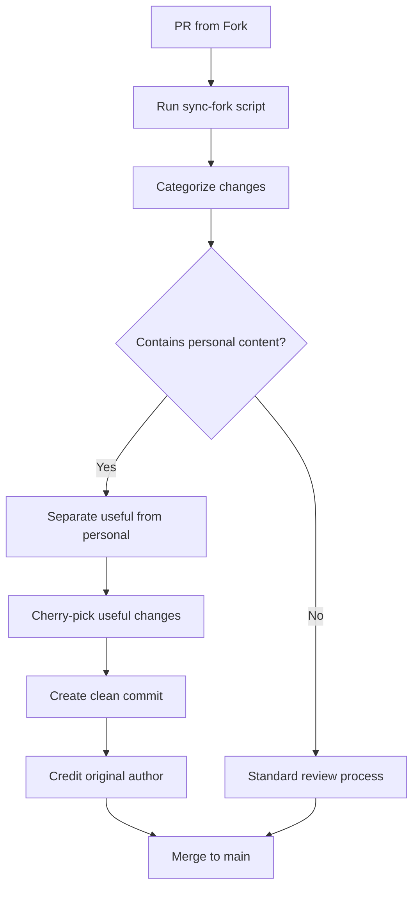

# Managing Open Source Forks: Lessons from Building a Blog Template

When you release an open source template, you hope people will use it, customize it, and maybe even contribute back. But what happens when someone forks your repository, adds their personal content, and then wants to contribute improvements? This is the story of how we learned to manage community forks effectively.

## The Challenge: Personal Content vs. Template Improvements

Our Next.js blog template attracted users like Gertjan, who forked the repository to create his personal blog. He added his own blog posts, images, and customizations. Later, he wanted to contribute back a comprehensive user manual - exactly what the template needed.

The problem? His pull request contained both valuable improvements AND his personal blog content. We needed the documentation but not his personal posts.

## The Wrong Approach: All or Nothing

Initially, we considered two extremes:
- **Accept everything**: Merge the PR and manually clean up later
- **Reject everything**: Ask him to create a clean PR (frustrating for contributors)

Both approaches have problems. The first pollutes the template with personal content. The second discourages contributions and puts burden on contributors.

## The Right Approach: Selective Integration

We developed a systematic approach for handling mixed contributions:

### 1. Categorize Changes Automatically

We built scripts that analyze fork changes and categorize them:

```bash
# Our sync script automatically categorizes changes
📝 Blog posts (likely personal content):
  - src/content/posts/01-my-personal-story.mdx
  - src/content/posts/02-my-vacation.mdx

📚 Documentation changes (potentially useful):
  - docs/USER-MANUAL.md
  - README.md

💻 Code changes (review needed):
  - scripts/new-feature.js
  - src/components/NewComponent.tsx
```

### 2. Cherry-Pick Valuable Contributions

Instead of merging entire PRs, we selectively integrate useful parts:

```bash
# Review the fork changes
npm run sync-fork gjvdptev

# Create clean integration branch
git checkout main
git checkout -b integrate-user-manual

# Cherry-pick only the documentation
git checkout pr-branch -- docs/USER-MANUAL.md
git add docs/USER-MANUAL.md
git commit -m "feat: add comprehensive user manual

Co-authored-by: Gert Jan <gjvdptev@users.noreply.github.com>"
```

### 3. Provide Clear Communication

We always explain what we accepted and why:

```markdown
Thanks for your contribution! I've integrated your USER-MANUAL.md 
into the template (commit abc123). This documentation is exactly 
what we needed for web-only users.

I didn't include the blog posts since they're specific to your 
personal blog, but the documentation is fantastic and will help 
many users.
```

## Tools We Built for Fork Management

### Fork Health Monitoring

```bash
# Check status of all known forks
npm run check-forks

# Output shows sync status and health
🔍 Checking: gjvdptev/next-blog
📊 Sync Status: Fork has diverged
📈 Main is 9 commits ahead
📥 Fork is 43 commits ahead
💡 Recommendations: Review fork changes
```

### Automated Change Analysis

Our sync script automatically categorizes changes by file patterns:
- Blog posts: `src/content/posts/*.mdx`
- Documentation: `docs/*.md`, `README.md`
- Code: `*.js`, `*.ts`, `*.tsx`
- Configuration: `package.json`, `.github/workflows/*`

### Selective Integration Workflow



## Best Practices We Learned

### 1. Set Clear Expectations

Document what types of contributions you accept:
- ✅ Bug fixes and improvements
- ✅ Documentation enhancements  
- ✅ New features that benefit all users
- ❌ Personal blog content
- ❌ Fork-specific customizations

### 2. Make Integration Easy

Provide tools and scripts that make selective integration straightforward:
- Automated change categorization
- Cherry-picking helpers
- Clear git workflows

### 3. Maintain Relationships

Always acknowledge valuable contributions, even when you can't accept everything:
- Give co-author credit
- Explain decisions clearly
- Provide alternative solutions

### 4. Monitor Fork Health

Keep track of active forks and help maintainers:
- Regular health checks
- Proactive sync assistance
- Troubleshooting support

## The Results

This approach has several benefits:

**For Template Maintainers:**
- Clean repository without personal content
- Valuable community contributions integrated
- Systematic process for handling mixed PRs

**For Fork Maintainers:**
- Recognition for valuable contributions
- Clear feedback on what's accepted
- Ongoing support for their fork

**For the Community:**
- Better documentation and features
- Clear contribution guidelines
- Sustainable open source project

## Key Takeaways

1. **Personal forks are valuable** - They often contain improvements worth integrating
2. **Selective integration works** - You don't need to accept everything or nothing
3. **Automation helps** - Scripts can categorize and analyze changes efficiently
4. **Communication is crucial** - Always explain decisions and give credit
5. **Relationships matter** - Treat contributors as partners, not problems

## Tools and Scripts

If you're managing a template repository, consider building:
- Fork health monitoring
- Automated change categorization
- Selective integration workflows
- Clear contribution guidelines

The investment in tooling pays off when you have active community contributors who want to give back while maintaining their personal forks.

---

*Managing open source forks is about finding the balance between accepting valuable contributions and maintaining project integrity. With the right tools and processes, both template maintainers and fork owners can benefit.*
