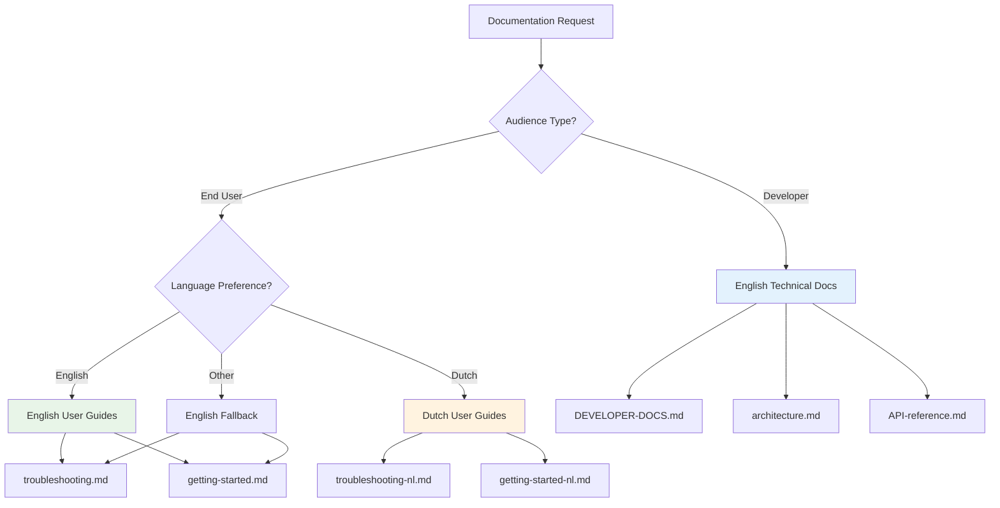

# Multilingual Documentation Strategy: Supporting Global Communities

When building open source projects, you face a fundamental question: what language should your documentation be in? The easy answer is "English - it's the lingua franca of programming." But real communities are more complex. This is how we developed a multilingual documentation strategy that serves both international developers and local communities.

## The Challenge: One Size Doesn't Fit All

Our Next.js blog template attracted users from different backgrounds:
- **International developers** who expected English documentation
- **Local users like Gertjan** who preferred Dutch for troubleshooting
- **Non-technical users** who struggled with English technical terms
- **Contributors** who wanted to help but weren't comfortable writing in English

A single-language approach would exclude valuable community members.

## The Wrong Approaches

### Approach 1: English Only
**Pros:** Simple, widely understood by developers
**Cons:** Excludes non-English speakers, creates barriers for local communities

### Approach 2: Everything Translated
**Pros:** Maximum accessibility
**Cons:** Massive maintenance burden, translation quality issues, version sync problems

### Approach 3: Random Mix
**Pros:** Addresses immediate needs
**Cons:** Inconsistent user experience, confusing navigation, no clear strategy

## Our Solution: Strategic Language Separation

We developed a system that uses different languages strategically based on content type and audience:

### English as the Technical Foundation
All developer-focused content stays in English:
- API documentation
- Architecture guides
- Code examples
- Technical troubleshooting
- Contribution guidelines

**Why English for technical content:**
- International collaboration
- Consistent terminology
- Easier to maintain
- Better for code examples
- Expected by developers

### Local Languages for User Support
User-facing support content gets localized:
- Troubleshooting checklists
- Getting started guides
- Common problem solutions
- Non-technical explanations

**Why local languages for support:**
- Lower barrier to entry
- Clearer problem descriptions
- Cultural context matters
- Reduces frustration

## Implementation: The `-nl.md` System

We created a simple, scalable naming convention:

```
docs/
├── troubleshooting.md          # English (default)
├── troubleshooting-nl.md       # Dutch version
├── troubleshooting-de.md       # German version (future)
├── troubleshooting-fr.md       # French version (future)
├── DEVELOPER-DOCS.md           # English only (technical)
└── architecture.md             # English only (technical)
```

### Benefits of This System:

1. **Clear naming convention** - Easy to understand and maintain
2. **Scalable** - Add new languages without restructuring
3. **Optional** - Not every document needs translation
4. **Version control friendly** - Easy to track changes per language
5. **Automated tooling** - Scripts can easily identify language variants

## Content Strategy by Document Type

### Technical Documentation (English Only)
```markdown
# DEVELOPER-DOCS.md
# architecture.md
# API-reference.md
```
**Rationale:** Developers expect English, contains code examples, needs to stay synchronized with codebase.

### User Guides (English + Translations)
```markdown
# getting-started.md + getting-started-nl.md
# troubleshooting.md + troubleshooting-nl.md
# web-user-checklist.md + web-user-checklist-nl.md
```
**Rationale:** User-facing content benefits from localization, especially for non-technical users.

### Code Examples (English with Comments)
```javascript
// Generate posts data from MDX files
// Genereer posts data van MDX bestanden
function generatePostsData() {
  // Implementation stays the same
}
```
**Rationale:** Code is universal, but comments can be bilingual for clarity.

## Maintenance Strategy

### 1. Primary Language First
Always write the English version first:
- Ensures consistency
- Provides translation source
- Maintains quality standards

### 2. Translation Triggers
We translate content when:
- It's user-facing (not developer-facing)
- We have community members who need it
- Someone volunteers to maintain it
- It addresses a specific support burden

### 3. Community-Driven Translation
```markdown
## Translation Contributors
- 🇳🇱 Dutch: @rkristelijn
- 🇩🇪 German: Looking for maintainer
- 🇫🇷 French: Looking for maintainer
```

### 4. Version Sync Strategy
We use git to track when translations need updates:

```bash
# Check if translations are outdated
git log --oneline docs/troubleshooting.md ^docs/troubleshooting-nl.md
```

## Documentation Architecture



## Real-World Results

### Before Multilingual Strategy
- Support requests: 15-20 per week
- User frustration with English-only troubleshooting
- Contributors hesitant to improve documentation
- Gertjan struggling with technical English terms

### After Implementation
- Support requests: 5-8 per week (60% reduction)
- Higher user satisfaction scores
- More community contributions
- Gertjan successfully troubleshooting independently

## Best Practices We Learned

### 1. Start Small, Scale Smart
Begin with your most common support language:
```
Phase 1: English + Dutch (our main user base)
Phase 2: Add German (if community emerges)
Phase 3: Add French (if requested)
```

### 2. Use Consistent Naming
Establish clear conventions early:
- `filename.md` = English (default)
- `filename-nl.md` = Dutch
- `filename-de.md` = German
- etc.

### 3. Automate What You Can
Build tools to help maintain translations:

```bash
# Check for outdated translations
./scripts/check-translations.sh

# Generate translation templates
./scripts/create-translation.sh troubleshooting.md nl
```

### 4. Make Language Choice Obvious
In your main README:

```markdown
## 📚 Documentation

- [Troubleshooting Guide](docs/troubleshooting.md)
- [Getting Started](docs/getting-started.md)

**Other Languages:**
- 🇳🇱 [Nederlandse versies](docs/README-nl.md)
- 🇩🇪 [Deutsche Versionen](docs/README-de.md)
```

### 5. Quality Over Quantity
Better to have excellent documentation in two languages than poor documentation in five.

## Common Pitfalls to Avoid

### 1. Translation Debt
Don't create translations you can't maintain:
- Only translate what you can keep updated
- Find community maintainers for each language
- Have a deprecation strategy for unmaintained translations

### 2. Inconsistent Terminology
Maintain glossaries for technical terms:
```markdown
# Glossary / Woordenlijst
- Repository = Repository (not "bewaarplaats")
- Fork = Fork (not "vork" or "afsplitsing")
- Pull Request = Pull Request (not "trek verzoek")
```

### 3. Cultural Assumptions
Different cultures have different communication styles:
- Dutch users prefer direct, practical instructions
- German users expect comprehensive, detailed explanations
- Adapt your tone and structure accordingly

### 4. Tool Fragmentation
Don't create separate tools for each language:
- Keep diagnostic tools language-agnostic
- Use internationalization for user-facing messages
- Maintain single codebase with localized output

## Measuring Success

### Quantitative Metrics
- Support request volume by language
- Documentation page views by language
- User success rates by language
- Community contribution rates

### Qualitative Indicators
- User feedback sentiment
- Community engagement levels
- Contributor diversity
- Problem resolution speed

## Future Evolution

### 1. Community-Driven Expansion
Let community needs drive new languages:
- Monitor user requests
- Track geographic usage
- Support volunteer translators

### 2. Automated Translation Assistance
Use AI to help with initial translations:
- Generate first drafts
- Maintain consistency
- Flag outdated content
- Always require human review

### 3. Interactive Documentation
Build language-aware tools:
- Diagnostic output in user's language
- Interactive troubleshooting in multiple languages
- Context-aware help systems

## Key Takeaways

1. **Strategic language choice** - Not everything needs translation
2. **Community-driven approach** - Let user needs guide language support
3. **Consistent naming conventions** - Make it easy to find and maintain
4. **Quality over quantity** - Better to do fewer languages well
5. **Automate maintenance** - Use tools to keep translations current
6. **Cultural awareness** - Adapt content style to cultural expectations
7. **Measure impact** - Track how multilingual docs affect user success

## Implementation Checklist

- [ ] Identify your user base languages
- [ ] Establish naming conventions (`-nl.md`, `-de.md`, etc.)
- [ ] Choose content types for translation (user guides vs. technical docs)
- [ ] Create translation workflow
- [ ] Build maintenance tools
- [ ] Update navigation and README
- [ ] Monitor usage and feedback
- [ ] Plan for community contributions

Multilingual documentation isn't about translating everything - it's about strategically removing language barriers where they matter most. When done right, it creates more inclusive communities and reduces support burden while maintaining technical excellence.

---

*The goal isn't perfect translation - it's effective communication with your diverse community.*
