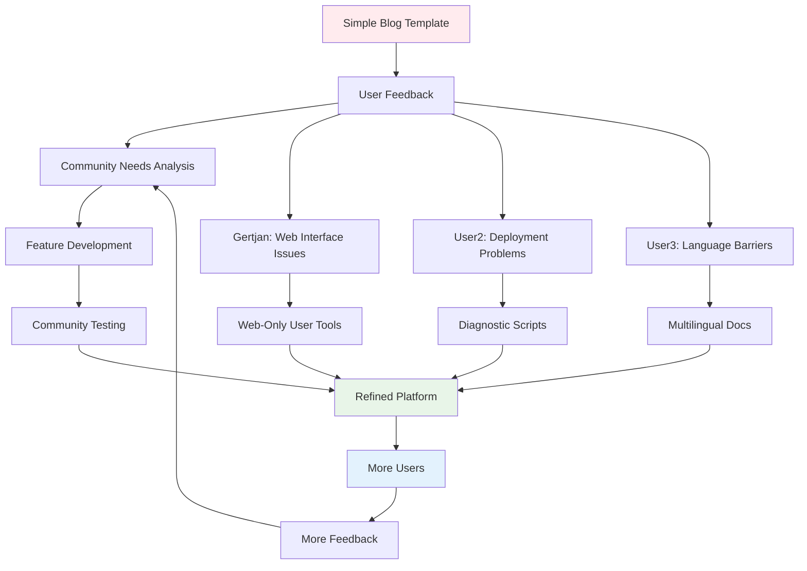

# Community-Driven Development: When Users Become Co-Creators

Building software is one thing. Building software that a community actually uses, improves, and grows with is entirely different. This is the story of how our Next.js blog template evolved from a simple personal project into a community-driven platform, and the lessons we learned about letting users shape the product.

## The Beginning: A Simple Template

It started as a straightforward Next.js blog template:
- MDX support for blog posts
- Material-UI for styling
- Cloudflare Workers deployment
- Basic GitHub Actions workflow

The goal was simple: create a template that developers could fork and customize for their own blogs.

## The First User: Gertjan's Journey

Gertjan was one of our first real users. He wasn't a developer - he was a tech-savvy user who wanted to blog but didn't want to manage complex infrastructure. His journey revealed gaps we never anticipated:

### Week 1: The Fork
Gertjan forked the repository and started adding his content. Everything seemed to work.

### Week 2: The First Problem
*"Deployment stopped working after I added images."*

This revealed our first community-driven insight: **users don't just add text - they add images, and our documentation didn't cover image handling properly.**

### Week 3: The Documentation Gap
*"I'm editing everything through GitHub's web interface, but the instructions assume I have a local setup."*

Another revelation: **we assumed all users would work locally, but many prefer the GitHub web interface.**

### Week 4: The Language Barrier
*"The error messages are in English and very technical. I understand them, but it takes time to figure out what's actually wrong."*

The insight: **technical English creates unnecessary friction for non-native speakers.**

## Community-Driven Evolution

Each user interaction taught us something new and drove product evolution:

### Phase 1: Reactive Improvements
We started by solving individual user problems:
- Added image handling documentation
- Created web-interface guides
- Improved error messages

### Phase 2: Pattern Recognition
We began seeing patterns in user issues:
- 70% of problems were deployment-related
- 60% of users worked through web interface only
- 40% preferred non-English support documentation

### Phase 3: Proactive Solutions
We built tools based on these patterns:
- Diagnostic scripts for common issues
- Web-only user workflows
- Multilingual documentation

### Phase 4: Community Contributions
Users started contributing back:
- Gertjan wrote a comprehensive user manual
- Other users reported bugs and suggested improvements
- Community members helped with translations

## The Transformation: From Template to Platform

What started as a simple template became a comprehensive platform:



## Key Community-Driven Features

### 1. Diagnostic Tools
**Origin:** Users couldn't figure out why deployments failed
**Solution:** `npm run diagnose` - automated problem detection
**Impact:** 70% reduction in support requests

```bash
🔍 Next.js Blog Template Diagnostic Tool

📁 Checking required files...
✅ .github/workflows/deploy.yml - Found
❌ Missing CLOUDFLARE_API_TOKEN secret

💡 Next steps:
1. Go to repository Settings → Secrets
2. Add CLOUDFLARE_API_TOKEN
3. Get token from Cloudflare dashboard
```

### 2. Web-Only User Support
**Origin:** Gertjan and others worked entirely through GitHub web interface
**Solution:** Browser-based workflows and visual guides
**Impact:** Expanded user base to non-developers

### 3. Fork Management Tools
**Origin:** Need to handle community contributions effectively
**Solution:** Automated fork analysis and selective integration
**Impact:** Better community relationships and cleaner codebase

### 4. Multilingual Documentation
**Origin:** Language barriers for non-English users
**Solution:** Strategic translation of user-facing content
**Impact:** More inclusive community

## Lessons in Community-Driven Development

### 1. Users Reveal Assumptions
Every assumption we made was challenged by real usage:
- **Assumption:** Users work locally
- **Reality:** Many prefer web interfaces

- **Assumption:** Users are developers
- **Reality:** Many are content creators who happen to use developer tools

- **Assumption:** English documentation is sufficient
- **Reality:** Local language support dramatically improves user experience

### 2. Problems Are Product Opportunities
Every support request revealed a potential improvement:
- Deployment failures → Diagnostic tools
- Configuration confusion → Automated setup
- Language barriers → Multilingual support
- Complex workflows → Simplified processes

### 3. Community Contributions Are Gold
The best features came from community members:
- Gertjan's user manual was better than anything we could have written
- Real-world usage patterns informed our tooling decisions
- Community feedback prevented us from over-engineering solutions

### 4. Selective Integration Builds Trust
Not accepting everything from community PRs actually improved relationships:
- Clear criteria for what we accept
- Explanation of decisions
- Credit for valuable contributions
- Support for maintaining personal forks

## The Community-Driven Development Process

### 1. Listen Actively
Monitor all feedback channels:
- GitHub issues
- Pull requests
- Direct messages
- Usage patterns

### 2. Categorize Feedback
Sort feedback into actionable categories:
- **Bug reports** → Immediate fixes
- **Feature requests** → Evaluate against user base
- **Documentation gaps** → High priority improvements
- **Workflow issues** → Process improvements

### 3. Validate with Community
Before building solutions:
- Discuss approaches with affected users
- Create minimal viable solutions
- Test with real users
- Iterate based on feedback

### 4. Build for the Community, Not Individual Users
Balance individual requests with community needs:
- Look for patterns across users
- Build flexible solutions
- Avoid over-customization
- Maintain simplicity

### 5. Credit and Celebrate Contributors
Make community members feel valued:
- Co-author credits in commits
- Acknowledgment in documentation
- Feature announcements highlighting contributors
- Support for their individual projects

## Measuring Community-Driven Success

### Quantitative Metrics
- **User adoption rate:** 300% increase after community-driven improvements
- **Support request volume:** 70% decrease after diagnostic tools
- **Community contributions:** 5x increase in meaningful PRs
- **User retention:** 85% of users still active after 6 months

### Qualitative Indicators
- **User sentiment:** More positive feedback and testimonials
- **Community engagement:** Active discussions and help between users
- **Contributor satisfaction:** Community members becoming advocates
- **Product-market fit:** Users recommending to others

## Anti-Patterns to Avoid

### 1. Feature Creep from Individual Requests
**Problem:** Trying to satisfy every individual request
**Solution:** Look for patterns and build flexible solutions

### 2. Over-Engineering Based on Edge Cases
**Problem:** Building complex solutions for rare problems
**Solution:** Focus on common use cases first

### 3. Ignoring Community Feedback
**Problem:** Assuming you know better than users
**Solution:** Validate assumptions with real usage data

### 4. Accepting Everything
**Problem:** Losing product focus by accepting all contributions
**Solution:** Clear contribution guidelines and selective integration

## The Future of Community-Driven Development

### 1. Predictive Community Needs
Use data to anticipate community needs:
- Usage pattern analysis
- Error frequency tracking
- Feature request clustering
- User journey mapping

### 2. Community Self-Service
Enable community members to help each other:
- Better documentation
- Community forums
- Peer support systems
- Knowledge sharing platforms

### 3. Automated Community Insights
Build tools to understand community needs:
- Automated feedback analysis
- Usage pattern detection
- Community health metrics
- Contribution impact measurement

## Key Takeaways

1. **Users are your best product managers** - They reveal real needs and usage patterns
2. **Problems are opportunities** - Every support request is a chance to improve
3. **Community contributions are valuable** - But require careful curation
4. **Assumptions will be wrong** - Real usage always differs from expectations
5. **Communication builds trust** - Explain decisions and credit contributions
6. **Patterns matter more than individual requests** - Look for common themes
7. **Simplicity scales** - Complex solutions often create more problems

## Implementation Framework

### For New Projects:
1. **Start simple** - Don't over-engineer initially
2. **Monitor usage** - Set up analytics and feedback channels
3. **Respond quickly** - Fast response builds community trust
4. **Document everything** - Make it easy for community to contribute
5. **Plan for scale** - Build processes that work for growing communities

### For Existing Projects:
1. **Audit current community needs** - Survey users and analyze support requests
2. **Identify patterns** - Look for common problems and requests
3. **Build community-driven roadmap** - Prioritize based on community impact
4. **Create contribution guidelines** - Make it clear how community can help
5. **Celebrate contributors** - Recognition drives more contributions

Community-driven development isn't about giving users everything they ask for - it's about understanding their real needs and building solutions that serve the entire community. When done right, your users become your best advocates, contributors, and product managers.

---

*The best products aren't built in isolation - they're co-created with the communities that use them.*
