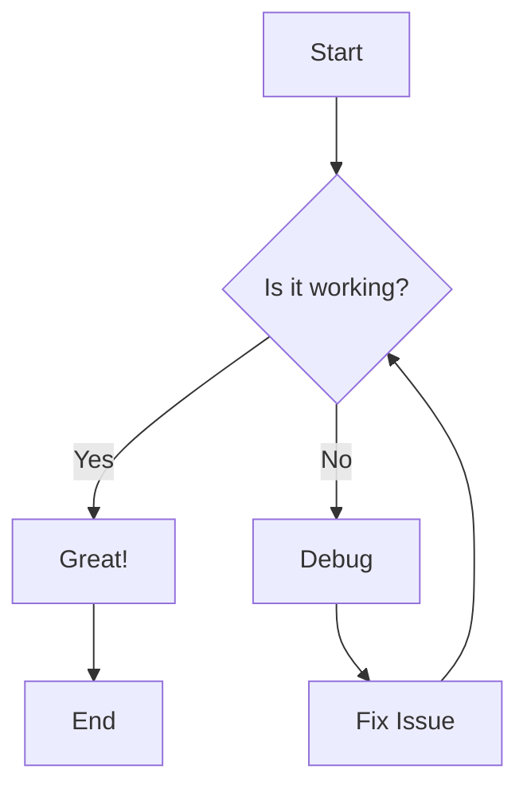
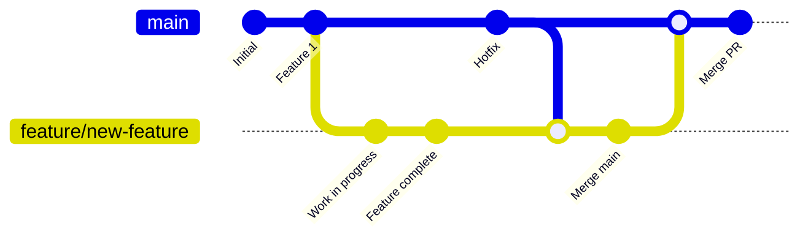
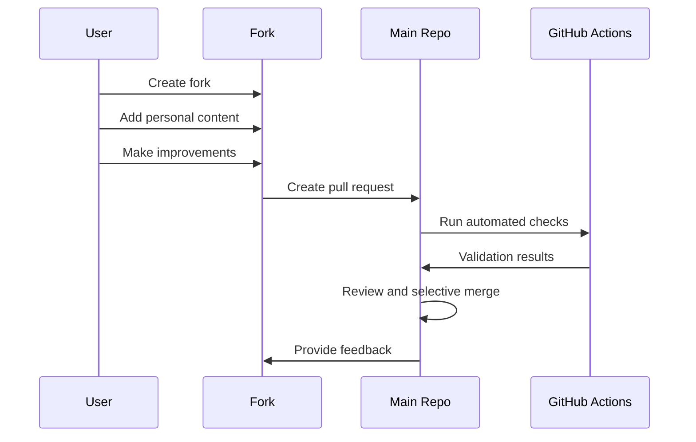
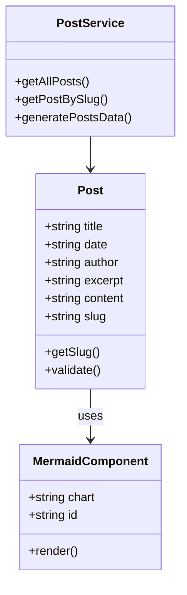
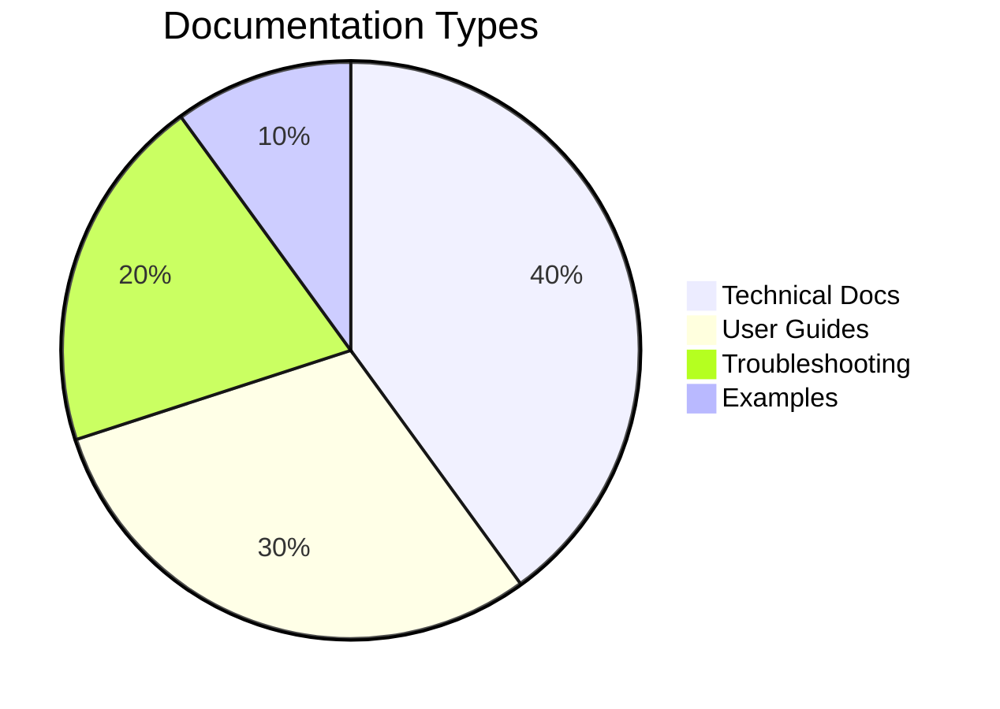
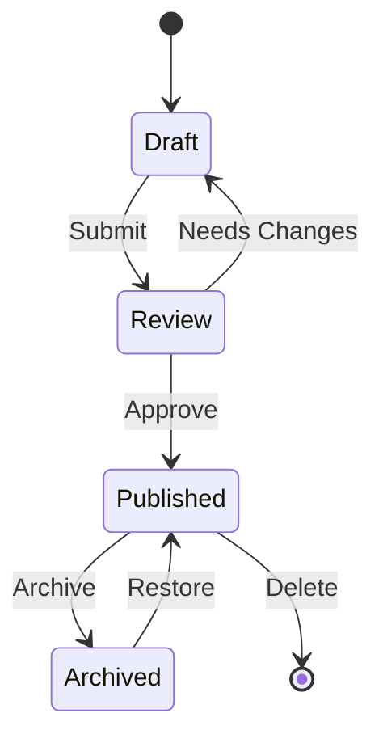
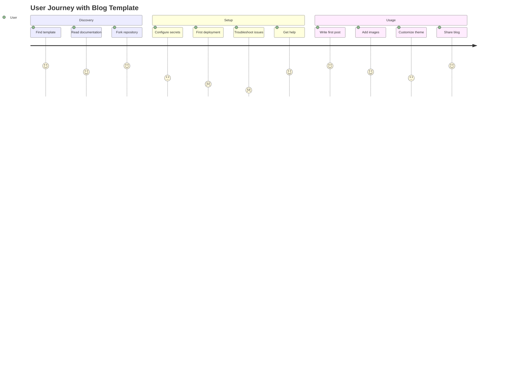

# Testing Mermaid Diagrams in Blog Posts

This post tests the Mermaid diagram functionality in our blog. Mermaid allows us to create diagrams and flowcharts using simple text syntax.

## Simple Flowchart

Here's a basic flowchart showing a decision process:



## Git Workflow Diagram

This diagram shows our new branch protection workflow:



## Sequence Diagram

Here's how the fork management process works:



## Class Diagram

The architecture of our blog system:



## Pie Chart

Distribution of our documentation types:



## State Diagram

The lifecycle of a blog post:



## Journey Map

User experience with our blog template:



## Testing Different Themes

These diagrams should automatically adapt to both light and dark themes. The Mermaid component uses the current Material-UI theme to configure colors and styling.

### Features Tested:
- ✅ Flowcharts with decision nodes
- ✅ Git graphs with branches and merges
- ✅ Sequence diagrams with multiple participants
- ✅ Class diagrams with relationships
- ✅ Pie charts with data visualization
- ✅ State diagrams with transitions
- ✅ Journey maps with emotional states
- ✅ Theme-aware rendering (light/dark mode)
- ✅ Responsive design for mobile devices

## Code Example

For comparison, here's regular code syntax highlighting:

```javascript
// Regular code block (not Mermaid)
function generateMermaidId() {
  return `mermaid-${Math.random().toString(36).substr(2, 9)}`;
}

console.log('This should be syntax highlighted, not rendered as a diagram');
```

And here's some TypeScript:

```typescript
interface MermaidProps {
  chart: string;
  id?: string;
}

const MermaidComponent: React.FC<MermaidProps> = ({ chart, id }) => {
  // Component implementation
  return <div>Mermaid diagram here</div>;
};
```

## Conclusion

If you can see properly rendered diagrams above (not just code blocks), then Mermaid integration is working correctly! The diagrams should:

1. **Render as visual diagrams** instead of code blocks
2. **Adapt to the current theme** (light/dark mode)
3. **Be responsive** and work on mobile devices
4. **Handle errors gracefully** if there are syntax issues

This enables us to create rich, visual documentation and blog posts with flowcharts, architecture diagrams, and process flows directly in Markdown.
