# Testing Mermaid Diagrams in Blog Posts

This post tests the Mermaid diagram functionality in our blog. Mermaid allows us to create diagrams and flowcharts using simple text syntax.

## Simple Flowchart

Here's a basic flowchart showing a decision process:


**Code for this diagram:**
````markdown

````

## Git Workflow Diagram

This diagram shows our new branch protection workflow:


## Sequence Diagram

Here's how the fork management process works:


**Code for this diagram:**
````markdown

````

## Class Diagram

The architecture of our blog system:


## Pie Chart

Distribution of our documentation types:


## State Diagram

The lifecycle of a blog post:


## Journey Map

User experience with our blog template:


## C4 Architecture Diagrams

### System Context Diagram

This shows our blog template in the context of its environment:

```mermaid
graph TB
    User[👤 Blog Users] --> Blog[Next.js Blog Template]
    Developer[👨‍💻 Developers] --> Blog
    
    Blog --> Cloudflare[☁️ Cloudflare Workers]
    Blog --> GitHub[📦 GitHub Repository]
    Blog --> CDN[🌍 Global CDN]
    
    subgraph "External Systems"
        Cloudflare
        GitHub
        CDN
    end
    
    subgraph "Next.js Blog Template"
        NextJS[Next.js 15 App]
        MDX[MDX Content]
        MUI[Material-UI]
        Mermaid[Mermaid Diagrams]
    end
    
    style Blog fill:#e1f5fe
    style Cloudflare fill:#fff3e0
    style GitHub fill:#f3e5f5
    style NextJS fill:#e8f5e8
    style MDX fill:#fff8e1
    style MUI fill:#fce4ec
    style Mermaid fill:#e8eaf6
```



**Code for this diagram:**
````markdown

````

### Container Diagram

This shows the main containers within our blog system:


These diagrams should automatically adapt to both light and dark themes. The Mermaid component uses the current Material-UI theme to configure colors and styling.

### Features Tested:
- ✅ Flowcharts with decision nodes
- ✅ Git graphs with branches and merges
- ✅ Sequence diagrams with multiple participants
- ✅ Class diagrams with relationships
- ✅ Pie charts with data visualization
- ✅ State diagrams with transitions
- ✅ Journey maps with emotional states
- ✅ Theme-aware rendering (light/dark mode)
- ✅ Responsive design for mobile devices

## Code Example

For comparison, here's regular code syntax highlighting:

```javascript
// Regular code block (not Mermaid)
function generateMermaidId() {
  return `mermaid-${Math.random().toString(36).substr(2, 9)}`;
}

console.log('This should be syntax highlighted, not rendered as a diagram');
```

And here's some TypeScript:

```typescript
interface MermaidProps {
  chart: string;
  id?: string;
}

const MermaidComponent: React.FC<MermaidProps> = ({ chart, id }) => {
  // Component implementation
  return <div>Mermaid diagram here</div>;
};
```

## Mermaid Resources and Documentation

### Official Documentation
- **Main Documentation**: [mermaid.js.org](https://mermaid.js.org/)
- **Live Editor**: [mermaid.live](https://mermaid.live/) - Test your diagrams online
- **Syntax Reference**: [Flowchart Syntax](https://mermaid.js.org/syntax/flowchart.html)
- **All Diagram Types**: [Diagram Syntax](https://mermaid.js.org/syntax/examples.html)

### Quick Reference
- **Flowcharts**: `flowchart TD` or `graph TB`
- **Sequence Diagrams**: `sequenceDiagram`
- **Class Diagrams**: `classDiagram`
- **State Diagrams**: `stateDiagram-v2`
- **Git Graphs**: `gitGraph`
- **Pie Charts**: `pie title "Chart Title"`
- **Journey Maps**: `journey`

### Tips for Better Diagrams
1. **Test First**: Always test complex diagrams in [mermaid.live](https://mermaid.live/)
2. **Keep It Simple**: Don't overcrowd diagrams with too many elements
3. **Use Colors**: Add `style` commands for better visual hierarchy
4. **Mobile Friendly**: Consider how diagrams look on small screens
5. **Meaningful Labels**: Use descriptive text for nodes and connections

## How to Use Mermaid in Your Blog Posts

### Step 1: Write Your Diagram
Create your diagram using Mermaid syntax in a code block:

````markdown

````

### Step 2: Test Online
Before publishing, test your diagram at [mermaid.live](https://mermaid.live/) to ensure it renders correctly.

### Step 3: Add to Your Post
Simply paste the code block into your `.mdx` file and it will automatically render as a visual diagram.

### Common Use Cases
- **Process Flows**: Show step-by-step processes
- **System Architecture**: Visualize component relationships  
- **User Journeys**: Map user experience flows
- **Decision Trees**: Show decision-making processes
- **Git Workflows**: Illustrate branching strategies
- **Data Flows**: Show how data moves through systems

## Conclusion

If you can see properly rendered diagrams above (not just code blocks), then Mermaid integration is working correctly! The diagrams should:

1. **Render as visual diagrams** instead of code blocks
2. **Adapt to the current theme** (light/dark mode)
3. **Be responsive** and work on mobile devices
4. **Handle errors gracefully** if there are syntax issues

This enables us to create rich, visual documentation and blog posts with flowcharts, architecture diagrams, and process flows directly in Markdown.
