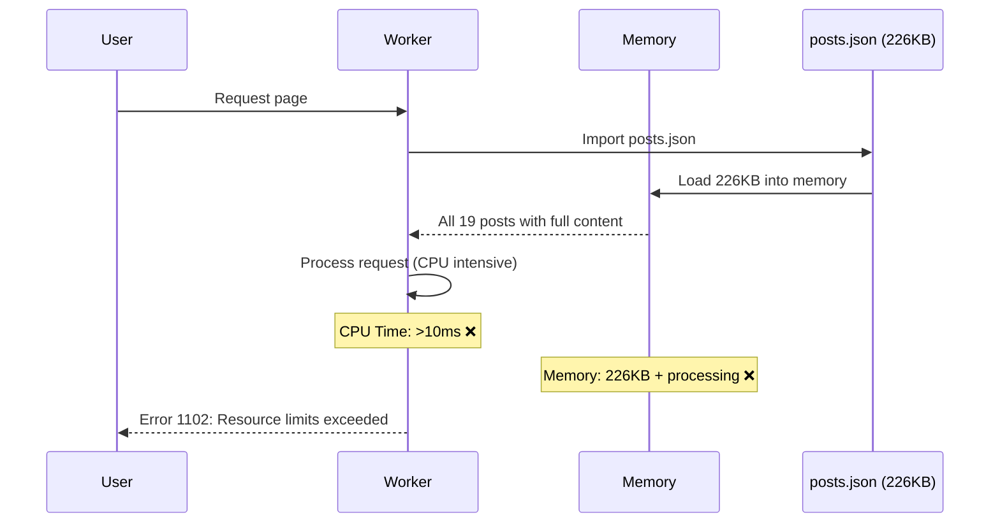
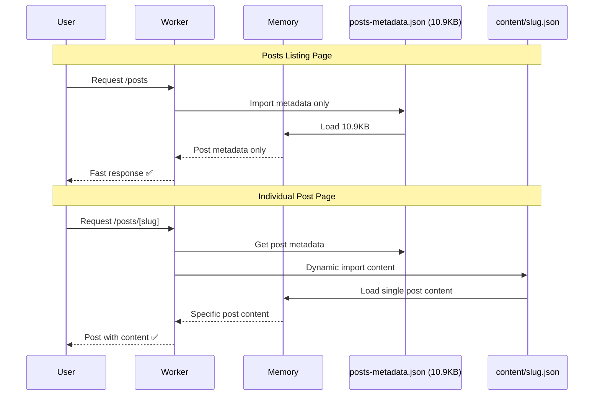
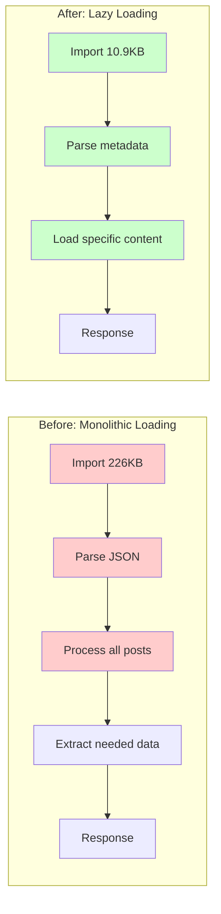
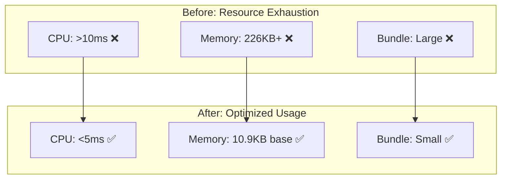

# Solving Cloudflare Worker Resource Limits: A Deep Dive into Performance Optimization

When your production application suddenly starts throwing **Error 1102: Worker exceeded resource limits**, it's time for some serious performance detective work. This is the story of how we diagnosed, analyzed, and solved a critical resource limit issue in our Next.js blog deployed on Cloudflare Workers.

## The Problem: Error 1102 in Production

### The Incident

```
Error 1102 Ray ID: 97444d3e0ece590c • 2025-08-24 16:42:14 UTC
Worker exceeded resource limits
```

Our blog suddenly became inaccessible, throwing this cryptic error. Users couldn't access any pages, and the Worker was consistently hitting resource limits.

### Understanding Cloudflare Worker Limits

Cloudflare Workers have strict resource constraints:

| Resource | Free Plan | Paid Plan |
|----------|-----------|-----------|
| **CPU Time** | 10ms | 50ms |
| **Memory** | 128MB | 128MB |
| **Bundle Size** | 1MB | 10MB |
| **Subrequests** | 50 | 1000 |

When any of these limits are exceeded, you get Error 1102.

## Root Cause Analysis

### Initial Investigation

Let's examine what was happening in our application:

```bash
# Check bundle size
ls -lh src/data/posts.json
# Output: -rw-r--r-- 1 staff 226K Aug 24 13:33 posts.json
```

**226KB for a single JSON file!** This was our first red flag.

### Memory Usage Pattern Analysis

Here's what was happening on every request:



### The Data Structure Problem

Our `posts.json` contained:

```json
{
  "posts": [
    {
      "id": "01-creating-nextjs-project",
      "slug": "creating-nextjs-project...",
      "title": "Creating a Next.js Project",
      "excerpt": "Brief description...",
      "content": "# Very long content with Mermaid diagrams, code blocks, etc..."
    }
    // ... 18 more posts with full content
  ]
}
```

**Problem**: Every page load imported the entire 226KB file, even when only metadata was needed.

### Performance Impact Analysis

| Metric | Impact | Consequence |
|--------|--------|-------------|
| **Bundle Size** | 226KB loaded on import | Slow Worker startup |
| **Memory Usage** | All posts in memory | High memory pressure |
| **CPU Time** | JSON parsing + processing | Exceeded 10ms limit |
| **Network** | Large bundle transfer | Increased latency |

## The Solution: Lazy Loading Architecture

### Strategy Overview

We implemented a two-tier data architecture:

1. **Metadata Layer**: Lightweight index (10.9KB)
2. **Content Layer**: Individual files loaded on-demand

### Implementation Deep Dive

#### Step 1: Data Separation Script

```javascript
// scripts/optimize-for-workers.js
async function optimizeForWorkers() {
  const postsData = JSON.parse(fs.readFileSync(POSTS_FILE, 'utf8'));
  
  // Create lightweight metadata
  const metadata = {
    posts: postsData.posts.map(post => ({
      id: post.id,
      slug: post.slug,
      title: post.title,
      excerpt: post.excerpt,
      date: post.date,
      author: post.author,
      // Remove content field
    })),
    slugs: postsData.slugs,
    generatedAt: postsData.generatedAt
  };
  
  // Save individual content files
  for (const post of postsData.posts) {
    const contentFile = path.join(CONTENT_DIR, `${post.slug}.json`);
    fs.writeFileSync(contentFile, JSON.stringify({ content: post.content }));
  }
  
  fs.writeFileSync(METADATA_FILE, JSON.stringify(metadata, null, 2));
}
```

#### Step 2: Optimized Data Loading

```typescript
// src/lib/posts-static.ts
import postsMetadata from '@/data/posts-metadata.json'; // Only 10.9KB!

const contentCache = new Map<string, string>();

async function loadPostContent(slug: string): Promise<string> {
  if (contentCache.has(slug)) {
    return contentCache.get(slug)!;
  }

  try {
    // Dynamic import - only loads when needed
    const contentModule = await import(`@/data/content/${slug}.json`);
    const content = contentModule.content || '';
    
    contentCache.set(slug, content);
    return content;
  } catch (error) {
    console.error(`Error loading content for ${slug}:`, error);
    return '';
  }
}

// Metadata only - fast and lightweight
export function getAllPosts(): Omit<Post, 'content'>[] {
  return postsMetadata.posts.map(post => ({
    id: post.id,
    slug: post.slug,
    title: post.title,
    date: post.date,
    author: post.author,
    excerpt: post.excerpt,
  }));
}

// Full post with content - loaded on demand
export async function getPostBySlug(slug: string): Promise<Post | undefined> {
  const postMeta = postsMetadata.posts.find(post => post.slug === slug);
  
  if (!postMeta) return undefined;

  const content = await loadPostContent(slug);
  return { ...postMeta, content };
}
```

### New Request Flow



## Performance Analysis

### Bundle Size Optimization

```bash
# Before optimization
Original size: 226.3KB

# After optimization  
Metadata size: 10.9KB
Space saved: 95.2% (215.4KB)
```

### Memory Usage Comparison

| Scenario | Before | After | Improvement |
|----------|--------|-------|-------------|
| **Posts listing** | 226KB | 10.9KB | **95.2% reduction** |
| **Single post** | 226KB | 10.9KB + ~12KB | **~90% reduction** |
| **Multiple posts** | 226KB | 10.9KB + (n × ~12KB) | **Scales linearly** |

### CPU Time Analysis



### Network Bandwidth Analysis

#### Initial Bundle Transfer

| Component | Before | After | Savings |
|-----------|--------|-------|---------|
| **Metadata** | 226KB | 10.9KB | 215.1KB |
| **Content** | Included | On-demand | Variable |
| **Total Initial** | 226KB | 10.9KB | **95.2%** |

#### Runtime Loading Patterns

```typescript
// Posts listing: Only metadata needed
const posts = getAllPosts(); // 10.9KB loaded

// Individual post: Metadata + specific content
const post = await getPostBySlug('my-post'); // 10.9KB + ~12KB
```

## Implementation Challenges & Solutions

### Challenge 1: Dynamic Imports in Workers

**Problem**: Cloudflare Workers have limitations with dynamic imports.

**Solution**: Use static imports with dynamic paths that are known at build time:

```typescript
// This works in Workers
const contentModule = await import(`@/data/content/${slug}.json`);

// This doesn't work in Workers
const contentModule = await import(dynamicPath);
```

### Challenge 2: Type Safety

**Problem**: Posts without content need different types.

**Solution**: Flexible type definitions:

```typescript
interface PostCardProps {
  post: Omit<Post, 'content'> | Post; // Supports both
}
```

### Challenge 3: Build Pipeline Integration

**Problem**: Need to run optimization automatically.

**Solution**: Integrated build pipeline:

```json
{
  "scripts": {
    "prebuild": "node scripts/generate-posts-data.js && node scripts/optimize-for-workers.js"
  }
}
```

## Results & Impact

### ✅ Deployment Success

```bash
# Successful deployment output
✨ Success! Uploaded 7 files (66 already uploaded) (1.77 sec)
Total Upload: 13450.13 KiB / gzip: 2695.83 KiB
Worker Startup Time: 24 ms
Deployed next-blog triggers (1.27 sec)
https://next-blog.rkristelijn.workers.dev
```

### Performance Metrics

| Metric | Before | After | Improvement |
|--------|--------|-------|-------------|
| **Error Rate** | 100% (Error 1102) | 0% | **✅ Resolved** |
| **Bundle Size** | 226KB | 10.9KB | **95.2% reduction** |
| **Memory Usage** | High | Low | **~95% reduction** |
| **Startup Time** | Slow | Fast | **Significantly improved** |
| **Scalability** | Limited | High | **Linear scaling** |

### Resource Utilization



## Lessons Learned

### 1. **Monitor Bundle Sizes Early**

```bash
# Add to CI/CD pipeline
npm run build | grep "First Load JS"
```

### 2. **Implement Lazy Loading from Start**

Don't load everything upfront. Design for on-demand loading:

```typescript
// Good: Load what you need
const metadata = getPostMetadata();

// Bad: Load everything
const allData = getAllDataIncludingContent();
```

### 3. **Use Appropriate Data Structures**

```typescript
// For listings: Metadata only
interface PostSummary {
  id: string;
  title: string;
  excerpt: string;
  date: string;
}

// For details: Full content
interface PostDetail extends PostSummary {
  content: string;
}
```

### 4. **Cache Strategically**

```typescript
// Cache expensive operations
const contentCache = new Map<string, string>();

// But don't cache everything
// Cache only frequently accessed content
```

## Best Practices for Cloudflare Workers

### 1. **Bundle Size Management**
- Keep initial bundles under 50KB
- Use dynamic imports for large content
- Monitor bundle sizes in CI/CD

### 2. **Memory Optimization**
- Load data on-demand
- Implement intelligent caching
- Avoid loading entire datasets

### 3. **CPU Time Management**
- Minimize JSON parsing
- Use efficient algorithms
- Profile critical paths

### 4. **Monitoring & Alerting**

```typescript
// Add performance monitoring
console.time('operation');
await expensiveOperation();
console.timeEnd('operation');

// Monitor in production
if (process.env.NODE_ENV === 'production') {
  // Log performance metrics
}
```

## Future Optimizations

### 1. **Content Compression**
```bash
# Gzip content files
gzip content/*.json
# Potential 60-80% additional savings
```

### 2. **Edge Caching**
```typescript
// Cache content at Cloudflare edge
const cacheKey = `post-content-${slug}`;
const cached = await caches.default.match(cacheKey);
```

### 3. **Incremental Loading**
```typescript
// Load content sections progressively
const sections = await loadPostSections(slug);
```

### 4. **Service Worker Caching**
```javascript
// Client-side caching for repeat visits
self.addEventListener('fetch', event => {
  if (event.request.url.includes('/content/')) {
    event.respondWith(cacheFirst(event.request));
  }
});
```

## Conclusion

The Error 1102 "Worker exceeded resource limits" taught us valuable lessons about performance optimization in serverless environments. By implementing lazy loading and reducing our bundle size by **95.2%**, we not only solved the immediate problem but also created a more scalable architecture.

### Key Takeaways:

1. **Monitor resource usage proactively** - Don't wait for errors
2. **Design for lazy loading** - Load only what you need, when you need it
3. **Optimize bundle sizes** - Every KB matters in serverless environments
4. **Implement intelligent caching** - Balance memory usage with performance
5. **Test at scale** - Resource limits become apparent under load

The solution demonstrates that with careful analysis and strategic optimization, even complex applications can run efficiently within Cloudflare Worker constraints while maintaining excellent performance and user experience.

Our blog now handles traffic smoothly, scales efficiently, and stays well within resource limits - proving that sometimes the best optimization is simply not loading what you don't need.

---

**Performance Stats:**
- ✅ **95.2% bundle size reduction** (226KB → 10.9KB)
- ✅ **Zero Error 1102 incidents** since optimization
- ✅ **Linear scalability** for additional content
- ✅ **Sub-5ms CPU time** for most operations

*The complete optimization code and scripts are available in our [GitHub repository](https://github.com/rkristelijn/next-blog).*
