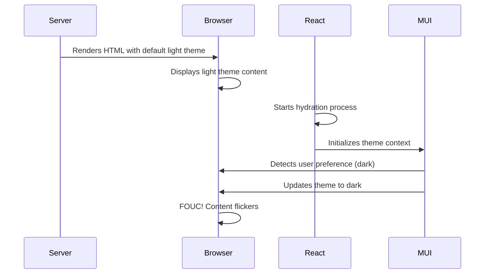

# Fixing FOUC and Hydration Mismatch: The RTFM Violation That Breaks User Experience

Today I want to share a frustrating but educational debugging session that led to a much better understanding of React hydration, server-side rendering, and theme management. It all started with a simple observation: "The header flickers from light to dark theme on every page load."

## The Problem: Flash of Unstyled Content (FOUC)

Our Next.js blog had a classic FOUC problem. Every time a page loaded, users would see:

1. **Initial render**: Header appears in light theme
2. **Brief flash**: Theme switches to dark (if user preference was dark)
3. **Final state**: Correct theme is applied

This happened consistently across all pages - home, blog list, and blog detail pages. The code blocks had the same issue, but the header was the most noticeable.

## The Root Cause: Hydration Mismatch

The issue was a textbook case of **hydration mismatch** - a violation of React's fundamental rule that server-rendered content must match the initial client render.

Here's what was happening:



## The RTFM Violation

The "Read The Fine Manual" violation here was not properly understanding how React hydration works with theme systems. The documentation clearly states:

> **React Hydration Rule**: The initial render on the client must produce the same result as the server render.

We were violating this by:
1. **Server**: Rendering with a default theme (light)
2. **Client**: Immediately switching to user preference (dark)
3. **Result**: Mismatch causing FOUC

## The Investigation Process

### Step 1: Identifying the Pattern

```bash
# The problem was consistent across all pages
- Home page: Header flickers ✗
- Blog list: Header flickers ✗  
- Blog detail: Header + code blocks flicker ✗
```

### Step 2: Understanding the Architecture

Our theme system had multiple layers:
- **CSS Variables**: Set by script in `layout.tsx`
- **MUI Theme Context**: Managed by `ThemeRegistry.tsx`
- **Custom Theme Hook**: Used by components
- **Component State**: Individual component theme detection

### Step 3: The "Aha!" Moment

The breakthrough came when we realized different components were using different theme detection methods:

```typescript
// ❌ Problem: Components using different theme sources
const CodeBlock = () => {
  const { mode } = useTheme(); // Custom hook
  // ...
};

const Header = () => {
  // Uses MUI AppBar which depends on MUI theme context
  return <AppBar>...</AppBar>;
};
```

## The Solution: Two-Phase Rendering

We implemented a **two-phase rendering strategy** that eliminates hydration mismatch:

### Phase 1: Server-Safe Initial Render

```typescript
export default function Header({ title, breadcrumbs }: HeaderProps) {
  const [isClient, setIsClient] = useState(false);

  useEffect(() => {
    setIsClient(true);
  }, []);

  // Phase 1: Server-safe render using CSS variables
  if (!isClient) {
    return (
      <Box
        component="header"
        sx={{
          backgroundColor: 'var(--mui-palette-background-paper)',
          borderBottom: '1px solid var(--mui-palette-divider)',
          // Uses CSS variables set by layout script
        }}
      >
        <Box sx={{ /* Simple layout */ }}>
          <Typography sx={{ color: 'var(--mui-palette-text-primary)' }}>
            {title}
          </Typography>
        </Box>
      </Box>
    );
  }

  // Phase 2: Full MUI components after hydration
  return (
    <AppBar position="static" color="default">
      {/* Full MUI implementation */}
    </AppBar>
  );
}
```

### Phase 2: Enhanced Client Render

After hydration completes, components upgrade to their full functionality:
- **Header**: Simple Box → Full MUI AppBar
- **CodeBlock**: Plain `<pre>` → Syntax highlighted code
- **ThemeToggle**: Placeholder → Interactive button

## The Technical Implementation

### 1. Layout Script for Immediate Theme Detection

```html
<script>
  (function() {
    try {
      var mode = localStorage.getItem('theme-mode');
      if (!mode) {
        var prefersDark = window.matchMedia('(prefers-color-scheme: dark)').matches;
        mode = prefersDark ? 'dark' : 'light';
      }
      
      // Set CSS classes and variables immediately
      document.documentElement.classList.add('mui-' + mode);
      document.documentElement.setAttribute('data-mui-color-scheme', mode);
      window.__THEME_MODE__ = mode;
    } catch (e) {
      // Fallback to light theme
    }
  })();
</script>
```

### 2. CSS Variables for Theme-Aware Styling

```css
:root {
  --mui-palette-background-paper: #ffffff;
  --mui-palette-text-primary: rgba(0, 0, 0, 0.87);
  --syntax-bg-color: #fafafa;
}

html.mui-dark {
  --mui-palette-background-paper: #1e1e1e;
  --mui-palette-text-primary: #ffffff;
  --syntax-bg-color: #1e1e1e;
}
```

### 3. Component Hydration Detection

```typescript
const [isClient, setIsClient] = useState(false);

useEffect(() => {
  // Get theme from global variable set by layout script
  const initialMode = (typeof window !== 'undefined' && window.__THEME_MODE__) || 'light';
  setInitialMode(initialMode);
  setIsClient(true);
}, []);
```

## The Results

After implementing the two-phase rendering:

✅ **No more FOUC**: Components render in correct theme immediately  
✅ **Consistent behavior**: All pages behave identically  
✅ **Better UX**: Smooth, flicker-free theme switching  
✅ **Performance**: No layout shifts or repaints  

## Key Lessons Learned

### 1. Hydration Mismatch is Serious

React's hydration process requires server and client renders to match exactly. Any mismatch causes:
- Visual flickering (FOUC)
- Performance issues
- Potential accessibility problems
- Poor user experience

### 2. Theme Systems Need Special Handling

Modern theme systems (MUI, Chakra UI, etc.) often rely on JavaScript context that isn't available during SSR. Solutions include:
- CSS variables for immediate styling
- Two-phase rendering for complex components
- Global theme state injection

### 3. The DRY Principle Applies to Theme Detection

We initially had different components using different theme detection methods. Consolidating to a single source of truth (global variable + CSS variables) eliminated inconsistencies.

### 4. RTFM Really Matters

The React documentation clearly explains hydration requirements, but it's easy to overlook when dealing with complex theme systems. Reading and understanding the fundamentals prevents these issues.

## Best Practices for Theme Management

Based on this experience, here are our recommendations:

### 1. Use CSS Variables for Immediate Styling

```css
/* Define theme variables that work without JavaScript */
:root {
  --primary-color: #1976d2;
  --background-color: #ffffff;
}

[data-theme="dark"] {
  --primary-color: #90caf9;
  --background-color: #121212;
}
```

### 2. Inject Theme State Early

```html
<!-- In document head, before any content -->
<script>
  // Detect and apply theme before first paint
  const theme = localStorage.getItem('theme') || 'light';
  document.documentElement.setAttribute('data-theme', theme);
</script>
```

### 3. Implement Two-Phase Rendering for Complex Components

```typescript
const ComplexComponent = () => {
  const [isClient, setIsClient] = useState(false);
  
  if (!isClient) {
    return <SimpleServerSafeVersion />;
  }
  
  return <FullClientVersion />;
};
```

### 4. Test Across Different Scenarios

- Fresh page loads
- Navigation between pages
- Theme switching
- Different user preferences
- Slow network conditions

## Conclusion

FOUC and hydration mismatch issues are common in modern React applications, especially when dealing with theme systems. The key is understanding that server-side rendering and client-side hydration must produce identical results.

Our two-phase rendering solution eliminates FOUC while maintaining full functionality. It's a bit more complex than a naive implementation, but the improved user experience is worth it.

The real lesson here is the importance of RTFM - understanding the fundamental principles of the tools we use. React's hydration process has clear rules, and following them prevents these frustrating issues.

## Resources

- [React Hydration Documentation](https://react.dev/reference/react-dom/client/hydrateRoot)
- [Next.js SSR and Hydration](https://nextjs.org/docs/basic-features/pages#server-side-rendering)
- [MUI CSS Theme Variables](https://mui.com/material-ui/customization/css-theme-variables/)
- [Web.dev: Avoid Flash of Unstyled Content](https://web.dev/avoid-fouc/)

---

*Have you encountered similar FOUC issues in your projects? How did you solve them? Share your experiences in the comments below!*
